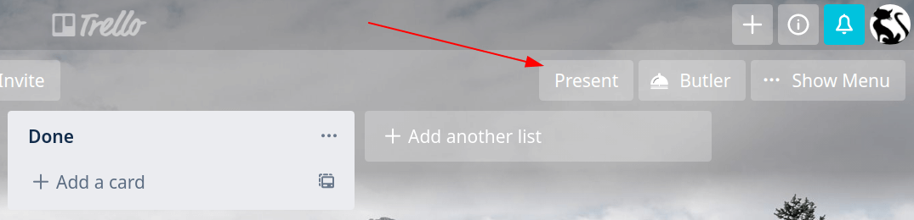
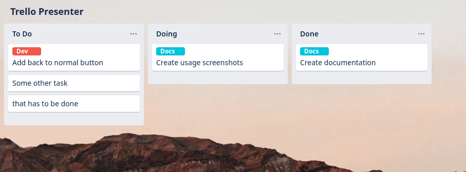

# Trello Presenter

	

### Usage
1. Click on the **Present** button

2. Enjoy ya

### Installation
1. Open the Extension Management page by navigating to `chrome://extensions`
2. Enable Developer Mode by clicking the toggle switch next to **Developer mode**
3. Click the **LOAD UNPACKED** button and select the extension directory
